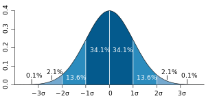

<!-- _class: title -->

# 不確かさ・最小二乗法

---
# 講義の受け方

## 心構え
1年生後期以降に習う知識を使う（もちろん導入は行う）ので，すべてを理解しようとしないこと．あくまで今回の講義は「わかった気になっていただく」ためのものである．少し難しい話も出てくるので，わからないなと思ったら後から見返せばOK．

## スライドについて
スライドは追記したのちに公開する．今板書用に欲しいという方には今すぐ差し上げる． 講義動画は撮らないし公開しない．

---
# 不確かさとは

## 測定の結果に付随した，合理的に測定対象量に結び付けられ得る値のばらつきを特徴づけるパラメータ
実験を行う際に生じる値のばらつきを統計的に処理し，実験により得られた値がどれほど確からしいかを考えるためのひとつのパラメータ（要素）
測定値の**曖昧さ**を表現しているとも言える

---
# 不確かさと誤差の違い

## 誤差：真の値は既知である，という前提
例えば，重力加速度$g = 9.80665\;\mathrm{m/s^2}$（標準重力加速度）のように具体的な値がわかっているものに対して，測定値$g = 9.81\;\mathrm{m/s^2}$は誤差$0.00335\;\mathrm{m/s^2}$を含んでいると言える （相対誤差$3.4\times 10^{-2}\;\%$）．
文献値が存在しないような実験（研究で値を求める場合）では考えることができない．
## 不確かさ: 真の値はわからない，という前提 
不確かさでは，文献値のように既に判明している値を考えない．→より実用的

---
# アナログな世界では，あらゆるものが誤差を含んでいる
的当てのアナロジー：どんなに精密に狙ったしても，様々な要因でどうしてもズレが生じる
##### 要因として考えられるもの
* 投げ方の癖
* 空気の流れ
* 矢の作りのばらつき etc......

---
# 的は中心（狙うべきポイント）がある．実験では？
## 物理量は人間が勝手に決めたもの
* 物理学は，人間がつくりあげた「数学」という言語を用いて自然現象を記述しただけ
* 別に重力加速度を$19.6133\;\mathrm{m/s^2}$と定義しても，本質的には変わらない（$g$を用いるすべての数式の$g$を$g/2$に置き換えるだけ）
## 人間が勝手につくったものだから，自然界は教えてくれない
* $\pi$などの数学定数は「数学」という体系で閉じているので記述可能であるが，物理学は自然界を「数学」というツールを用いてモデリングしたものなので，数式で完全な値を求めることはできない．

---
# 不確かさの原因（テキストp7〜10）
## 個人的要因
測定者が未熟であること，測定の個人的な癖や不注意，過失によって生じる
* 目盛は通常1/10まで読み取る→人によって多少異なることがある
* 読み取り角度

---
# 不確かさの原因（テキストp7〜10）

## 系統的要因
測定器具の誤差や，理論式に含まれる近似などによって生じる

---
# 不確かさの原因（テキストp7〜10）

## 偶然的要因
物理現象は人間が都合よく考えたモデル→そう一筋縄にはいかないのが現実
* 予測不能な周囲の温度変動，電源電圧の変動
* 実験装置の機械的な振動や，周囲の空気の不規則な流れ

---
# 不確かさの原因（テキストp7〜10）

## 現象自体が確率的である
量子論的な現象は本質的に確率的（化学概論第一で扱う）

---
# 不確かさの種類（テキストp6）
## Aタイプの評価
測定を繰り返すことにより得られたデータに統計的な解析を行い，標準偏差に基づいて不確かさを評価する

## Bタイプの評価
測定を繰り返すことができない場合（危険な実験である，あるいは希少な現象であるために複数回の測定ができない等），あるいは測定を繰り返さなかった場合には，測定に関する知識や経験などから標準偏差を推定して評価する

---
# 標準不確かさを学ぶ前に
## Gauss分布
$$p(x) = \frac{1}{\sqrt{2\pi}\sigma}\exp\left\{-\frac{1}{2}\left(\frac{x - X}{\sigma}\right)^2\right\}$$
ただし，$\sigma$: 標準偏差 $X$: 期待値（平均値）

---
# 中心極限定理（確率統計や数理統計学で学ぶ）
## 大数の法則
**標本平均は母平均に近づいてゆく，という定理**
プログラムで実演

## 中心極限定理
**標本平均の分布は正規分布に近づく**
プログラムで実演（時間がかかるので，既に実行済みのものを表示）

## 母平均が「真の値」であると信じて測定結果を評価する→標準不確かさ

---
# Aタイプの評価（標準不確かさ）（テキストp10〜）
## 母平均$X$がわかっているときの標準偏差
$$\sigma = \sqrt{\frac{1}{N}\sum_{i = 1}^N(x_i - X)^2}$$
高校のときに習う標準偏差はこのタイプ．全数調査．

---
# Aタイプの評価（標準不確かさ）（テキストp10〜）
## 母平均$X$が未知であるときの標準偏差
母平均$X$は未知なので，測定値（標本）の平均$\bar{x}$を用いて標準偏差の推定値を求める（$\sigma'^2$を不偏標準分散という）
$$\sigma' = \sqrt{\frac{1}{N-1}\sum_{i = 1}^N(x_i - \bar{x})^2}$$
このとき，$\Delta x = \sigma'$を**測定値の標準不確かさ**という（「標準」は「標準偏差」の「標準」）

---
# Aタイプの評価（標準不確かさ）（テキストp10〜）
## 平均値$\bar{x}$の標準不確かさ
$\sigma'$は「測定値の不確かさ」である．平均値そのものの標準不確かさは，
$$\Delta \bar{x} = \frac{\Delta x}{\sqrt{N}}$$
**平均をとると不確かさが小さくなる！**
（導出が気になる人は，「不偏推定量」や「有効推定量」などを調べるとよい）
## 拡張不確かさ
標準不確かさに感度係数$c$というものをかけたものを拡張不確かさと呼ぶことがある

---
# 使い方

重力加速度の測定値が次の表のようになったとする（分散を考えるので，最低でも3つの測定値が必要）

|  回数  |  値$/\mathrm{ms^{-2}}$ |
| ---- | ---- |
|  1  |  $9.79$  |
|  2  |  $9.82$ |
|  3  |  $9.80$  |
|  4  |  $9.81$  |

**平均値** $\bar{x} = (9.79+9.82+9.80+9.81)/4 = 9.85\;\mathrm{ms^{-2}}$

---
# 個々の測定値の不確かさ
$$\sigma' = \sqrt{\frac{1}{5-1}\{(9.79-9.805)^2+(9.82-9.805)^2+(9.80-9.805)^2+(9.81-9.805)^2\}}=0.0111\;\mathrm{ms^{-2}}$$
不確かさは通常1桁（繰上げ）で考えるので，以下のようになる
|  回数  |  値$/\mathrm{ms^{-2}}$ |
| ---- | ---- |
|  1  |  $9.79 \pm 0.02$  |
|  2  |  $9.82 \pm 0.02$ |
|  3  |  $9.80 \pm 0.02$  |
|  4  |  $9.81 \pm 0.02$  |

---
# 測定値の代表として平均値を用いる（根拠：大数の法則）
$$\frac{\sigma'}{\sqrt{N}} = 0.00222\;\mathrm{ms^{-2}}$$
平均値は$9.805\;\mathrm{ms^{-2}} \simeq 9.81\;\mathrm{ms^{-2}}$
したがって$0.00222\;\mathrm{ms^{-2}} \simeq 0.01\;\mathrm{ms^{-2}}$とする（有効数字の最終桁に合わせる）
※もしも不確かさが有効数字の最終桁より大きくなった場合には，不確かさの桁数に合わせる．例えば測定値が有効数字3桁で$9.81\;\mathrm{ms^{-2}}$，不確かさが$0.1\;\mathrm{ms^{-2}}$であるときは，測定値を$9.8\;\mathrm{ms^{-2}}$とする
|    |  値$/\mathrm{ms^{-2}}$ |
| ---- | ---- |
|  平均値  |  $9.81 \pm 0.01$  |

---
# Bタイプの評価

## 次元とノルム
辺の長さが$a$，$b$の長方形の対角線の長さ:$\sqrt{a^2 + b^2}$
辺の長さが$a$，$b$，$c$の直方体の対角線の長さ:$\sqrt{a^2 + b^2 + c^2}$
$n$次元だとどうなる？
→$\sqrt{{x_1}^2 + {x_2}^2 + \cdots + {x_n}^2}$

ベクトルの長さ（ノルム）は上記のようなプロセスで求められる（詳しくは線形代数）

---
# Bタイプの不確かさ

## ベクトル空間
「和」と「スカラー倍」という演算が定義されていればなんでもベクトルとみなしてよい，という主張（詳しくは後期の線形代数）
実は，誤差もベクトルとみなしてよい

## 不確かさの原因が複数ある場合の総合した不確かさ
不確かさの原因が複数ある場合の総合した不確かさ$\Delta x$は次のようになる
$$\Delta x = \sqrt{(\Delta x_1)^2 + (\Delta x_2)^2 + (\Delta x_3)^2 + \cdots }$$

---
# Bタイプの評価

## 個々の測定値の不確かさが異なる場合（あまり使わない......？）
逆2乗の重みつき平均を考える．
平均
$$\bar{x} = \frac{\frac{x_1}{(\Delta x_1)^2} + \frac{x_2}{(\Delta x_2)^2} + \cdots + \frac{x_N}{(\Delta x_N)^2}}{\frac{1}{(\Delta x_1)^2} + \frac{1}{(\Delta x_2)^2} + \cdots \frac{1}{(\Delta x_N)^2}}$$
不確かさ
$$\Delta \bar{x} = \frac{1}{\sqrt{\frac{1}{(\Delta x_1)^2} + \frac{1}{(\Delta x_2)^2} + \cdots \frac{1}{(\Delta x_N)^2}}}$$

---

# 図にしてみよう

|  測定値  |  不確かさ$/\mathrm{ms^{-2}}$ |
| ---- | ---- |
|  標準不確かさ |  $0.03$  |
|  定規による不確かさ |  $0.04$ |
|  おもりの質量による不確かさ  |  $0.05$  |

---
# 不確かさの伝播を扱う前に......

## 偏微分とは（微積では後期，物概では前期の後半）
多変数関数のある変数$x$以外の変数を定数とおき，$x$で微分することを「$x$で偏微分する」といい，$\displaystyle \frac{\partial f}{\partial x}$と表記する．

## 例
$f(x, y) = x^2 + 3xy + 5y^2$に対して，$\displaystyle \frac{\partial f}{\partial x} = 2x + 3y$，$\displaystyle \frac{\partial f}{\partial y} = 3x + 10y$である．

---
# 不確かさの伝播

## 不確かさを持つ物理量$x$から導かれる$y$の不確かさ
計算によって$x$の誤差が拡大・縮小する．$x$と$y$の不確かさ$\Delta x$と$\Delta y$は独立ではなく，$y = f(x)$という関係式を手掛かりにした関係式を立てるべきである

$$\Delta y = \left|\frac{\mathrm{d}y}{\mathrm{d}x}\right|\Delta x$$
（導出は割愛）

---
# 不確かさの原因が複数ある場合の不確かさの伝播

## 合成標準不確かさ
$$\Delta x = \sqrt{(\Delta x_1)^2 + (\Delta x_2)^2 + (\Delta x_3)^2 + \cdots }$$
と
$$\Delta y = \left|\frac{\mathrm{d}y}{\mathrm{d}x}\right|\Delta x$$
の合わせ技
$$\Delta y = \sqrt{\left(\frac{\partial f}{\partial x_1}\right)^2(\Delta x_1)^2 + \left(\frac{\partial f}{\partial x_2}\right)^2(\Delta x_2)^2 + \left(\frac{\partial f}{\partial x_3}\right)^2(\Delta x_3)^2 + \cdots }$$

---
# 最小二乗法とは

* 読み方は「さいしょうじじょうほう」．
* 測定値から「それっぽい直線・曲線」（回帰曲線）を求めるための手法
* 理論式がわかっている前提（測定値から曲線形の数式を予測することはできない）

---
# 1次式（$y = ax$）の最小二乗法

---
# 1次式（$y = a + bx$）の最小二乗法

---
# 2次式（$y = a + bx + cx^2$）の最小二乗法
大変なので割愛．

---
# $n$次式の最小二乗法
一般的には行列計算を用いて行われる（II類では2年生の数値解析や数理統計学で行う）

---
# 講義はこれで終わりです

## 来週，ピアノの会の場を借りてLaTeXの講習会をするかも知れません（詳細が決まり次第Twitter等で拡散します） 是非来てください！

---

# 参考文献

* 実験テキスト
* 東京大学教養学部統計学教室, "基礎統計学III 自然科学の統計学"（東京大学出版会，東京, 1992）
* 稲垣宣生，"数学シリーズ 数理統計学（改訂版）"（裳華房，東京，2003）

* https://unit.aist.go.jp/riem/ds-rg/uncertainty/download_file/2014_JAIMA01_01.pdf
* https://ja.wikipedia.org/wiki/%E6%AD%A3%E8%A6%8F%E5%88%86%E5%B8%83